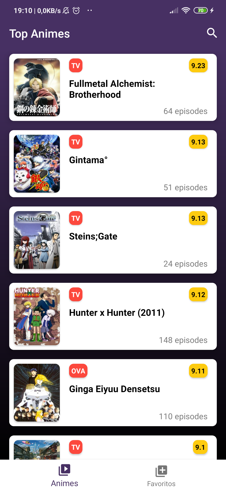
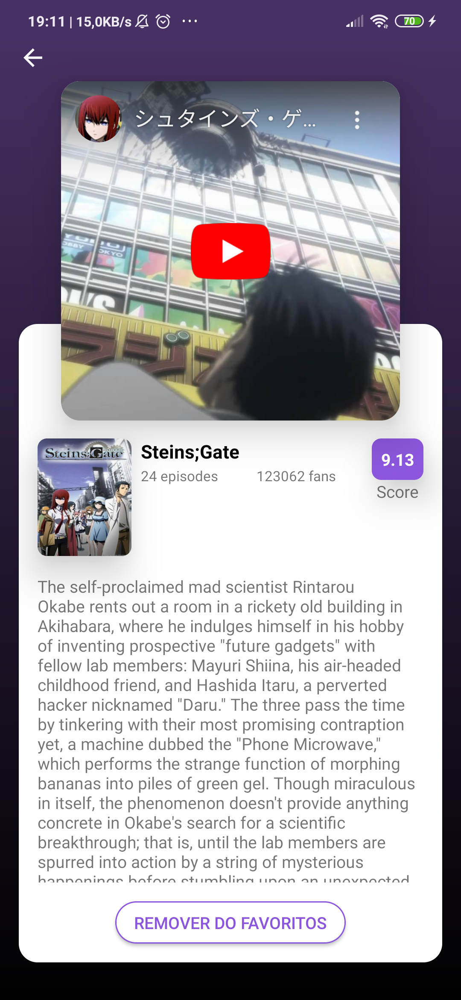
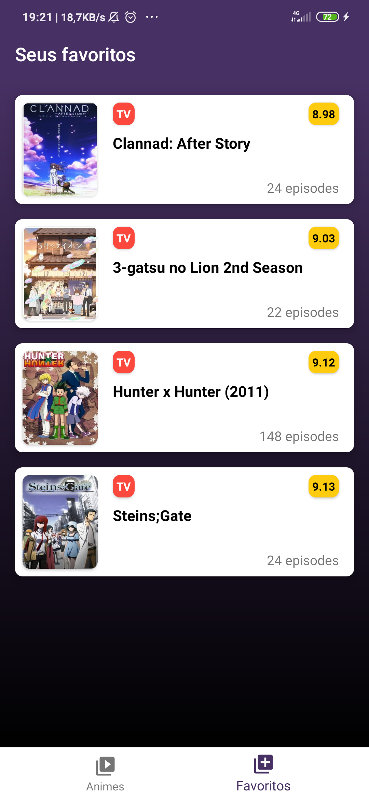

<h1 align="center">
  
   
  Android Anime
</h1>

<h4 align="center">
  Aplicativo densenvolvido no padrão MVVM + Jetpack
</h4>

  

  

  

  
  

  

  

## Sobre
Em desenvolvimeto...

## Projeto
Desenvolvido com as tecnologias mais recentes no desenvolvimento de aplicações Android, utlizando a arquitetura MVVM, injenção de dependências e android architecture.

## Tecnologias

-  [Kotlin](https://kotlinlang.org/)
-  [Coroutines](https://github.com/Kotlin/kotlinx.coroutines)
-  [Koin](https://insert-koin.io/)
-  [Retrofit](https://square.github.io/retrofit/)
-  [Picasso](https://square.github.io/picasso/)
-  [Room](https://developer.android.com/topic/libraries/architecture/room)
-  [LiveData](https://developer.android.com/topic/libraries/architecture/livedata)
-  [ViewModel](https://developer.android.com/topic/libraries/architecture/viewmodel)

## Imagens

  
  
  

## Contato
E-mail: <igguerra07@gmail.com>
 
LinkedIn: https://www.linkedin.com/in/igguerra
